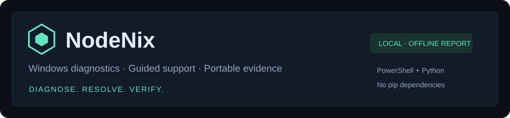

# NodeNix

**Diagnose. Resolve. Verify.**

A local Windows diagnostics and IT support toolkit. NodeNix collects endpoint evidence with PowerShell, applies explainable triage rules, and produces an offline console, investigation notes and a portable support bundle.



**Version 0.1.2 · Python 3.9+ · Windows PowerShell 5.1+ · MIT license**

No Python packages to install. The report opens as a local HTML file. Collection, suggested actions, confirmed repairs and verification remain separate steps.

## Try it

Download or clone the repository and open **`samples/DemoReport/Report.html`** locally. It contains fictional evidence and requires no installation.

For your Windows computer, open PowerShell in the NodeNix folder:

```powershell
py -3 nodenix.py demo --open
py -3 nodenix.py scan --open
```

Install [Python for Windows](https://www.python.org/downloads/windows/) if `py` is unavailable. The live collector needs Windows; demo, report generation and comparison also work on Linux/macOS with `python3`.

Reports default to **`%TEMP%\NodeNix\scan`** for a scan, `...\demo` for the demo, and `...\report` for an imported scan. The console prints the exact report and ZIP paths. Windows may clean temporary files; choose another writable folder with `--out` when retaining evidence.

```powershell
# Opt-in network probes
py -3 nodenix.py scan --connectivity --open

# Keep before/after evidence in separate folders
py -3 nodenix.py scan --out "$env:TEMP\NodeNix\before"
py -3 nodenix.py scan --out "$env:TEMP\NodeNix\after"
py -3 nodenix.py compare "$env:TEMP\NodeNix\before\Scan.json" "$env:TEMP\NodeNix\after\Scan.json"

# Create a reduced share report in a DIFFERENT folder
py -3 nodenix.py report "$env:TEMP\NodeNix\before\Scan.json" --profile share --out "$env:TEMP\NodeNix\share" --open
```

## What it does

| Area | Implemented checks and evidence |
| --- | --- |
| System and hardware | OS/build, BIOS, model, uptime, memory, CPU/GPU, battery charge, Device Manager errors |
| Storage | Fixed-drive capacity/free space, filesystem and Windows physical-disk health |
| Network | Addresses, gateway, DNS, DHCP, adapters and optional gateway/Internet ICMP, DNS and HTTPS probes |
| Windows | Services, top 30 processes by memory, startup entries, drivers, hotfixes and reboot indicators |
| Events and printers | Bounded System/Application event records, installed printers, queue metadata and spooler state |
| Security evidence | Defender, firewall profiles, BitLocker, Secure Boot, TPM, local admins and established TCP connections |
| Technician workflow | Six guided procedures, editable ticket notes, KB drafts and explicit verification fields |
| Reporting | Offline HTML console, JSON, section CSVs inside a ZIP, ticket skeleton and SHA-256 manifest |

The console supports finding search, severity filtering, section inspection, workflow selection, ticket/KB downloads and printing to PDF. Ticket edits stay in memory until downloaded. A resolved ticket requires a verification entry, which is a documentation guard rather than proof that the result is correct.

## Confirmed repair commands

Open an Administrator PowerShell window. Preview first, then run the selected action with confirmation:

```powershell
powershell.exe -NoProfile -ExecutionPolicy Bypass -File .\collector\Repair-NodeNix.ps1 -Action FlushDNS -WhatIf
powershell.exe -NoProfile -ExecutionPolicy Bypass -File .\collector\Repair-NodeNix.ps1 -Action FlushDNS
```

Available actions: `FlushDNS`, `RestartSpooler`, `SFC`, `DISMCheck`.

Spooler restart may interrupt printing. SFC may repair protected system files. DISMCheck runs `/CheckHealth`, which checks the recorded component-store health state. Repairs check audit-log access before starting and record started/completed/failed outcomes under the OS temp directory, normally `%TEMP%\NodeNix\repairs.jsonl`. A custom `-AuditPath` is supported.

Collect fresh evidence and reproduce the original symptom before closing a ticket. Audit logs stay local and are not automatically added to support bundles.

## Privacy and publishing

- **Local** is the default for scan/demo and contains hostname, account names, serials, addresses and identifying inventory. Keep these files private.
- **Share** is the default for imported reports. An explicit whitelist retains broad system/storage details, probe outcomes and selected security posture. Identifying inventories and collection error details are omitted, then findings are recomputed from the retained evidence.
- Omitted evidence reduces diagnostic usefulness. Share exports still require review; they do not guarantee anonymity.

Collectors do not request passwords, recovery keys, process command lines, Wi-Fi SSIDs, file contents or event-message bodies. HTML renders collected values as text, CSVs neutralize formula-like values, and bundles contain only explicitly generated files. The sample scans and reports in this repository are fictional.

See [SECURITY.md](SECURITY.md) and [publishing instructions](docs/Publishing.md) before adding real screenshots or reports to the repository.

## Error handling and the Windows fixes

The collector now launches with **`-ExecutionPolicy Bypass` for its child process only**. Saved policy is unchanged, and organization Group Policy can still take precedence. Outputs default to the working temporary location rather than the extracted Downloads folder. Defender can remain enabled.

NodeNix checks output access before collecting, validates imported JSON, bounds collection time, reports unavailable sections explicitly, and refuses to overwrite a source scan with its report export. Generation is staged before replacing existing files. Each final file replacement is atomic; the set of all output files is not a single transaction.

```powershell
py -3 nodenix.py scan --scan-timeout 600 --event-hours 48
py -3 nodenix.py --debug scan
```

Normal failures return a readable message without a Python traceback. `--debug` exposes diagnostics and local paths. Exit codes: `0` success, `1` runtime failure, `2` invalid arguments, `130` interruption. Browser-opening failure leaves the completed exports available.

Read [Troubleshooting.md](docs/Troubleshooting.md) for policy blocks, protected-folder writes, unavailable checks and the observed `%TEMP%` workaround.

## Design and scope

[Architecture](docs/Architecture.md) · [Lab cases](docs/Lab-Cases.md) · [Roadmap](docs/Roadmap.md) · [Changelog](CHANGELOG.md)

An unavailable check is unknown, and a stopped automatic service is not automatically faulty. ICMP may be filtered. One failed website probe does not establish an Internet outage. Hotfix inventory is not a complete update history. Windows storage health does not replace full SMART or manufacturer diagnostics. Defender may be inactive when approved third-party antivirus is installed.

AD account administration, remote agents/fleet management, Microsoft 365-specific diagnostics, malware detection, process hashes, temperature sensors and full SMART remain roadmap features.

## Validation and contributing

```powershell
py -3 -m unittest discover -s tests -v
```

With Node.js installed, the dependency-free dashboard logic harness is:

```powershell
node tests/test_dashboard.cjs
```

GitHub Actions is configured for Python regression tests, dashboard logic, PowerShell parser/WhatIf checks and a passive Windows collection smoke test. Configuration is not evidence that the hosted jobs have passed; check the repository's Actions tab after upload. The local build passed **33 Python tests** and the dashboard logic harness. The owner reported the manual Windows collector and report working after changing the destination to `%TEMP%`; the latest release still needs native Windows validation.

[Validation record](docs/Validation.md) · [Contributing](CONTRIBUTING.md)

[](https://github.com/sysn1xlabs)

Created by **[sysn1xlabs](https://github.com/sysn1xlabs)**. Released under the [MIT license](LICENSE).
