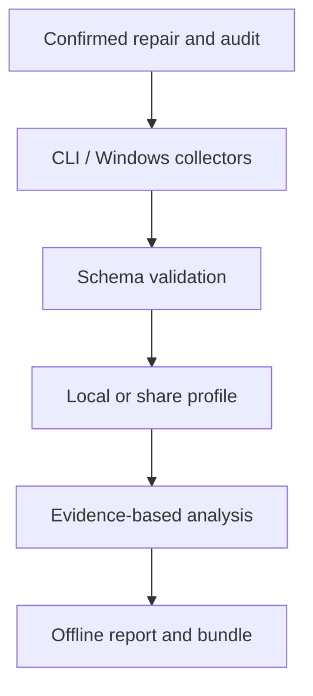

# Architecture

- `nodenix.py` delegates to `nodenix/cli.py`. The CLI handles demo, scan, report and compare, output preflight, bounded collection, friendly failures and browser fallback. It launches PowerShell with an argument array and process-only execution policy, without changing saved policy or elevating itself.
- `collector/Collect-NodeNix.ps1` preflights its destination and collects 21 independent sections. Failed sections remain unavailable. Inventory sections have a consistent array shape, including empty arrays. Missing object data is not a pass.
- `nodenix/validation.py` bounds and validates UTF-8 schema-1 imports, record shapes and consumed numeric/boolean fields before analysis/export.
- `nodenix/privacy.py` applies the share whitelist before analysis. New/unrecognized sections are omitted until explicitly reviewed.
- `nodenix/engine.py` contains deterministic triage rules and six guided procedures. Findings expose observations and next steps, rather than confirmed root-cause claims.
- `nodenix/report.py` and `dashboard.html` generate a self-contained console and explicit bundle payload. Generation happens in a private staging directory before final file replacement. Each replacement is atomic; the collection of files is not a single transaction. HTML escapes JSON, renders evidence as text, and neutralizes CSV values/headers.
- `collector/Repair-NodeNix.ps1` accepts four defined actions with ShouldProcess/WhatIf and confirmation. It checks privileges and initial audit-write access before action execution, records the final outcome and requires separate verification.
- `scripts/check_public_tree.py` checks the publishable source/sample tree for live scan payloads and known generated exports. `scripts/package_release.py` archives explicit checked source files and emits a checksum.

Schema 1 stores metadata `{schema_version, version, mode, generated_at, elevated}` and `sections[name] = {status, data, error?}`. Status is `ok`, `unavailable` or `omitted`. Raw live JSON is collected in a disposable temporary directory; only the selected export profile is written to the chosen report folder.

The workflow distinguishes collected observations, suggested actions, actual technician actions and subsequent verification. Ticket/KB export is a local download. The report does not execute PowerShell.
